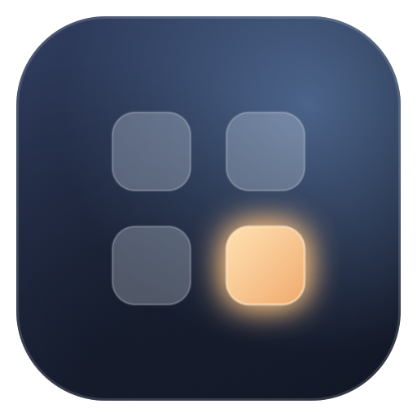
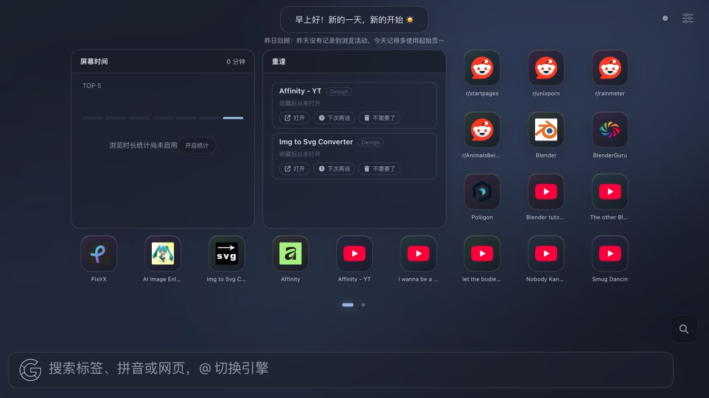
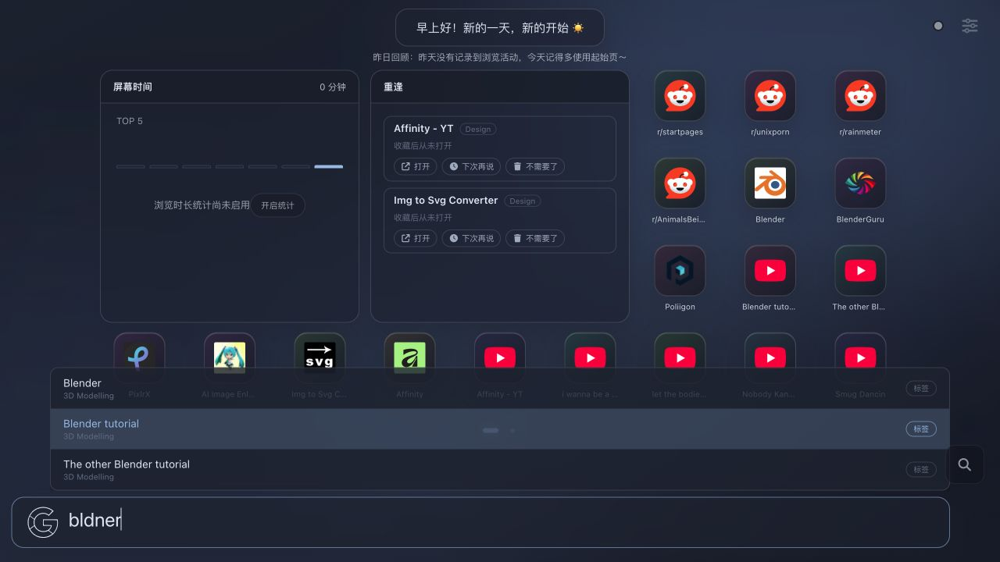
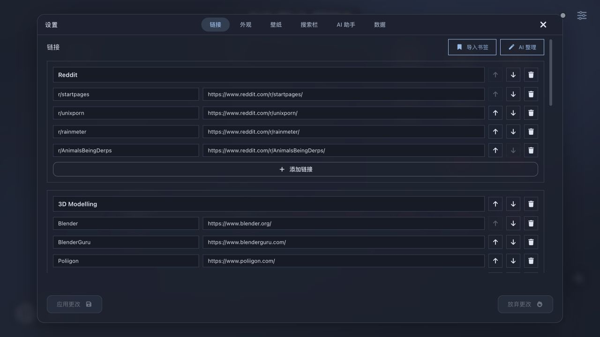
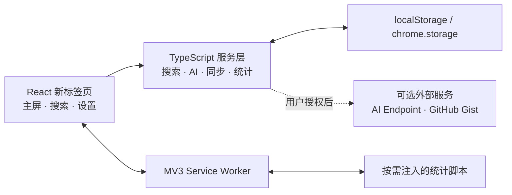

<div align="center">
  

  <h1>拾光 · Shiguang</h1>

  <p>
    <strong>把收藏铺成主屏，让被遗忘的链接重新被看见。</strong>
  </p>

  <p>
    一款为 Chromium 浏览器打造的 iOS 风格新标签页扩展。<br />
    它把书签、智能搜索、稍后读、智能入口、RSS 阅读流与可选 AI 能力，收进一个安静而有生命力的主屏。
  </p>

  <p>
    <a href="https://github.com/keepkeen/fluidity/stargazers">
      
    </a>
    <a href="https://github.com/keepkeen/fluidity/network/members">
      
    </a>
    <a href="./LICENSE">
      
    </a>
  </p>

  <p>
    
    
    
    
    
  </p>

  <p>
    <a href="#-为什么是拾光">亮点</a> ·
    <a href="#-功能全景">功能</a> ·
    <a href="#-安装">安装</a> ·
    <a href="#%EF%B8%8F-快捷键">快捷键</a> ·
    <a href="#-隐私与权限">隐私</a> ·
    <a href="#-开发指南">开发</a>
  </p>
</div>

<br />



<div align="center">
  <sub>玻璃质感主屏 · 语义尺寸小组件 · 智能入口 · RSS 阅读流 · 自由分页</sub>
</div>

---

## ✨ 为什么是拾光

大多数起始页只是在“摆放链接”。拾光更关心的是：如何让几十、几百个收藏仍然易于抵达，如何让注意力留下温和的反馈，以及如何在不牺牲隐私的前提下提供智能能力。

<table>
  <tr>
    <td width="25%" valign="top">
      <h3>📱 像主屏一样自然</h3>
      <p>图标与小组件共享网格。长按编辑、拖拽排序、左右滑页，交互方式无需重新学习。</p>
    </td>
    <td width="25%" valign="top">
      <h3>⌘ 搜索真的聪明</h3>
      <p>直接输入中文、英文、完整拼音或首字母；即使拼错，也能从标签和历史搜索中找到答案。</p>
    </td>
    <td width="25%" valign="top">
      <h3>🌙 克制的智能</h3>
      <p>AI 完全可选，支持 DeepSeek、OpenAI 兼容端点与自定义模型，不把你锁进单一服务。</p>
    </td>
    <td width="25%" valign="top">
      <h3>🔐 数据属于你</h3>
      <p>浏览统计默认关闭；云同步可选，并在上传 Gist 前使用 AES-GCM 在本地加密。</p>
    </td>
  </tr>
</table>

## 🪄 功能全景

### 主屏与导航

- **应用式书签**：自动获取高清站点图标，失败时回退到与主题协调的字母图标。
- **自由分页**：根据窗口大小二维排布；支持鼠标或触控左右拖动、滚轮、页码圆点与数字快捷键。
- **跟手滑动**：拖动期间直接更新页面轨道，具备方向锁定、边缘阻尼、甩动切页与回弹。
- **精准点击区域**：只有可见图标是点击目标，图标周围的空白可以安心用于拖页。
- **长按编辑**：进入抖动编辑状态后可排序、移除或隐藏项目，手动顺序优先保留。
- **组件库与总览**：点击页码旁的编辑按钮即可添加、改尺寸、复制、跨页移动；总览支持拖放和键盘移动。

### 智能搜索

- **无需命令前缀**：在首页直接打字，搜索框会自动获得焦点并保留第一个字符。
- **多语言匹配**：中文、英文、完整拼音、拼音首字母与常见多音字读法均可匹配。
- **模糊容错**：支持字符缺失、顺序近似等输入错误，例如 `bldner` 仍可找到 `Blender`。
- **历史联想**：历史查询会按相关度、使用频率和最近时间去重排序，即使它不是现有标签也能再次搜索。
- **可控建议层**：标签优先，总数最多 8 条；支持 ↑ / ↓、Enter、Esc 和鼠标选择，窄屏内有限滚动。
- **多搜索引擎**：使用 `@` 临时切换引擎，也可配置自定义 OpenSearch 风格地址和快捷词跳转。

<table>
  <tr>
    <th width="50%">拼写容错与标签联想</th>
    <th width="50%">结构化设置中心</th>
  </tr>
  <tr>
    <td></td>
    <td></td>
  </tr>
</table>

### 小组件系统

- **屏幕时间**：按域名汇总当天使用时长，卡片展示预算与趋势，点击后查看完整排行；翻页只暂停界面读取，后台计时不会停止。
- **显式授权**：统计默认关闭，只有用户启用后才申请站点访问权限；新标签页本身不会计时。
- **重逢卡片**：每天从长期未访问或从未打开的收藏中挑选内容；“不再推荐”不会删除原收藏，并支持即时撤销。
- **稍后读**：在扩展弹窗一键收下当前页面，支持打开、完成、延后、移除、撤销和转为正式收藏。
- **智能入口**：只使用设备上的近 30 天点击记录，结合当前时段、星期、频率与最近使用，给出带原因的入口推荐。
- **RSS / 阅读流**：解析 RSS、Atom 与 RDF，支持多订阅源、未读状态、条件请求、离线缓存和失败退避；组件离开当前页后暂停网络刷新。
- **语义尺寸**：小号、横向、中号、大号对应固定网格跨度；卡片只展示摘要，完整内容在详情抽屉中滚动。
- **周报与月报**：把浏览时长和导航数据整理成可读的阶段总结。

### AI 助手（可选）

- **AI 问候语与每日回顾**：根据你允许共享的本地摘要生成轻量提示。
- **AI 链接整理**：分析现有书签并提出分组结果，应用前仍由你确认。
- **AI 主题生成**：用自然语言描述氛围，由模型给出配色，再由本地规则保证可读性。
- **OpenAI 兼容接入**：支持 Base URL 或完整 `/chat/completions` 地址、自定义模型与本地开发端点。
- **真实错误反馈**：保留服务商返回的 401 / 402 / 403 / 429 信息，便于定位密钥、余额和频率问题。

> [!NOTE]
> AI 功能默认不启用。拾光不会附带公共 API Key；你需要自行选择服务商、模型和端点。

### 个性化与同步

- **主题系统**：内置多套深浅主题，并支持颜色变量与自然语言主题生成。
- **精选壁纸**：月泊、暮山、松风、胭脂、霜晨、烟青六套预设，可跟随主题切换。
- **自定义壁纸**：支持链接、本地上传、Bing 每日壁纸和多种显示方式。
- **书签导入**：通过可选 `bookmarks` 权限读取浏览器书签，导入后即可撤销权限。
- **导入 / 导出**：本地备份会主动排除 AI API Key，恢复时也不会覆盖现有密钥。
- **加密 Gist 同步**：AES-GCM + PBKDF2 本地加密，按数据键合并多设备变更，避免整个快照互相覆盖。

## 📦 安装

### 方式一：从源码构建（当前推荐）

环境要求：**Node.js 20+**、npm、Chromium 内核浏览器。

```bash
git clone https://github.com/keepkeen/fluidity.git
cd fluidity
npm ci
npm run build:extension
```

构建产物位于 `build/`。随后：

1. 打开 `chrome://extensions` 或 `edge://extensions`；
2. 开启右上角的「开发者模式」；
3. 点击「加载已解压的扩展程序」；
4. 选择项目中的 `build/` 目录；
5. 新建一个标签页，即可进入拾光。

### 方式二：安装发布包

前往 [Releases](https://github.com/keepkeen/fluidity/releases) 下载最新压缩包，解压后按上面的第 1～5 步加载。若 Releases 暂无与当前代码对应的构建，请使用源码方式安装。

> Chrome Web Store 与 Edge Add-ons 版本仍在准备中。商店上线前，请只从本仓库下载构建产物。

## 🚀 五分钟上手

1. **导入收藏**：设置 → 链接 →「导入书签」，或直接新建分组和链接。
2. **整理主屏**：长按任意应用，或点击页码旁的编辑按钮；添加组件、改尺寸并拖动调整顺序。
3. **选择外观**：设置 → 外观 / 壁纸，选择主题、图标尺寸、网格密度和壁纸。
4. **决定是否统计**：屏幕时间默认关闭；需要时在卡片或数据设置中主动启用。
5. **按需接入 AI**：设置 → AI 助手，填写 API Key、模型和兼容端点，先测试再保存。

## ⌨️ 快捷键

| 操作 | 默认按键 | 说明 |
|---|---:|---|
| 随手搜索 | 直接输入 | 在非输入控件、非弹窗状态下自动聚焦首页搜索栏 |
| 链接命令面板 | `/` | 浏览全部标签并快速跳转 |
| 扩展级命令面板 | `Ctrl/⌘ + Shift + K` | 可在浏览器扩展快捷键页面修改 |
| 临时切换引擎 | `@快捷名 空格` | 例如 `@g 关键词`，具体快捷名可配置 |
| 选择建议 | `↑` / `↓` | 在搜索建议或命令面板中移动 |
| 执行 | `Enter` | 打开选中标签；未选中时进行网页搜索 |
| 关闭 | `Esc` | 收起建议、面板或弹窗 |
| 跳转主屏页 | `Alt + 1…9` | 修饰键可改为 Control、Shift，或完全关闭 |

## 🔐 隐私与权限

拾光采用“**先解释、后授权、可关闭**”的权限策略。

| 权限 / 数据 | 用途 | 默认状态 |
|---|---|---|
| `storage` | 保存主题、链接、布局与设置 | 必需 |
| `bookmarks` | 用户主动导入浏览器书签 | 可选，按需申请 |
| 网站访问权限 | 启用屏幕时间后统计活跃页面域名和时长 | 可选，默认关闭 |
| RSS 订阅域名 | 只访问用户主动添加的 RSS / Atom 来源 | 可选，按订阅源申请 |
| AI 端点权限 | 向用户配置的服务商发送请求 | 可选，保存 / 启用时申请 |
| GitHub Gist | 用户主动开启跨设备同步 | 可选，本地加密后上传 |

安全边界：

- 屏幕时间只保存域名级统计，不把新标签页自身算入浏览时长；
- RSS 正文不注入远程 HTML 和图片；缓存只留在当前设备，不进入备份或云同步；
- 第三方 favicon 请求只携带书签的站点来源，不发送路径、查询参数或片段；
- AI API Key 不进入备份和 Gist 同步数据；
- 自定义 AI 端点拒绝远程明文 HTTP，仅为 localhost / 127.0.0.1 / `[::1]` 保留开发例外；
- 关闭统计时会撤销动态脚本注册，授权失败也不会伪装成已启用。

## 🧱 技术架构



核心技术栈：

- **UI**：React 18、Emotion、Font Awesome
- **语言与构建**：TypeScript 5、Vite 6
- **扩展平台**：Chrome Manifest V3、Service Worker、Optional Permissions
- **交互**：Pointer Events、CSS transforms、响应式二维分页
- **质量保障**：Vitest、ESLint、TypeScript、Playwright + 真实 MV3 扩展回归

## 🛠 开发指南

```bash
# 安装依赖
npm ci

# 启动本地开发服务器
npm run dev

# TypeScript + ESLint
npm run verify

# 单元测试
npm test

# 生产构建
npm run build:extension

# 真实 Chromium MV3 端到端回归
# 首次运行前：npx playwright install chromium
MV3_E2E_HEADLESS=1 npm run test:e2e:mv3

# 生成版本化 zip，输出到 dist/
npm run build:zip
```

### 项目结构

```text
fluidity/
├── public/                     # Manifest、图标、预设壁纸
├── scripts/                    # 打包与 MV3 端到端测试
├── src/
│   ├── Startpage/              # 新标签页、主屏、设置、报告
│   ├── components/             # 通用 UI 组件
│   ├── extension/              # Service Worker 与内容脚本
│   ├── hooks/                  # React hooks
│   ├── popup/                  # 扩展弹窗
│   ├── services/               # AI、搜索、统计、同步、备份
│   ├── data/                   # 默认数据、主题与静态定义
│   └── utils/                  # 日志、URL 安全等工具
├── README.md
└── package.json
```

### 提交前检查

```bash
npm run verify
npm test
npm run build
MV3_E2E_HEADLESS=1 node scripts/mv3-e2e.mjs
git diff --check
```

## 🗺 路线图

- [ ] Chrome Web Store / Edge Add-ons 正式发布
- [ ] 更完善的触屏与无障碍细节
- [ ] 同步删除标记与冲突可视化
- [ ] 社区主题与壁纸画廊

欢迎通过 [Issues](https://github.com/keepkeen/fluidity/issues) 提交问题与建议，也欢迎 Fork 后发起 Pull Request。

## ❓ 常见问题

<details>
  <summary><strong>为什么屏幕时间一直是 0？</strong></summary>
  <br />
  屏幕时间默认关闭。请在卡片中点击「开启统计」或前往「设置 → 数据」，授予站点访问权限。启用后只统计普通 HTTP(S) 页面，新标签页不计入。
</details>

<details>
  <summary><strong>AI 测试成功，但链接整理提示 401 怎么办？</strong></summary>
  <br />
  请确认已保存最新的 API Key、模型和端点。当前版本的链接整理、问候语、报告和主题生成会共用同一套 OpenAI 兼容配置，不再强制回退到 DeepSeek 官方端点。
</details>

<details>
  <summary><strong>为什么拼音搜索只能找到标签，不能直接打开？</strong></summary>
  <br />
  输入时建议默认不抢占 Enter：按 ↓ 选中标签后再按 Enter 打开；如果不选择建议，Enter 会继续执行普通网页搜索。这样可以避免模糊匹配误跳转。
</details>

## 🙏 致谢与来源

拾光基于 [PrettyCoffee/fluidity](https://github.com/PrettyCoffee/fluidity) 发展而来，并在其开源基础上重新设计了主屏、交互、视觉体系、搜索、统计、AI 接入与同步能力。

感谢以下项目和社区：

- [React](https://react.dev/) 与 [Vite](https://vite.dev/) 提供现代前端基础设施；
- [Font Awesome](https://fontawesome.com/) 提供图标资源；
- 原项目贡献者与所有提出建议、复现问题和参与测试的人。

内部存储键仍保留 `fluidity` 前缀，以兼容历史数据；这不影响产品名称「拾光」。

## 📄 许可证

本项目遵循 [MIT License](./LICENSE)。原项目版权声明与许可证文本完整保留。

---

<div align="center">
  <p><strong>如果拾光让你的新标签页更安静、更好用，欢迎点一颗 ⭐。</strong></p>
  <p><sub>愿每一次打开，都能遇见真正想去的地方。</sub></p>
</div>
